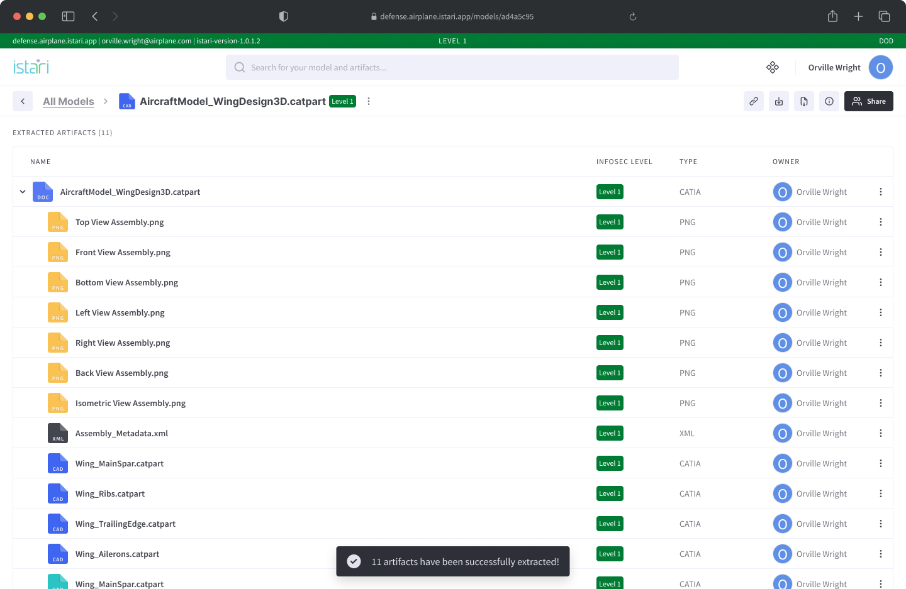

# Extract Artifacts

Extracting artifacts is a useful feature that allows users to isolate specific components or elements from a larger file for further analysis, sharing, or manipulation.

## Prerequisites

Before proceeding with the extraction process, ensure that you have the necessary permissions to perform extraction on the desired file. Additionally, confirm that the file type supports artifact extraction.

## Step-by-Step Guide

### 1. Accessing the File

**Home Screen:** Navigate to the home screen of the platform.

**Select File:** Find and click on the file you wish to extract artifacts from. You can locate files under the "Recent Models" section on the homepage or by going to the "All Models" page. This will open the overview page of the file.

### 2. Initiating the Extraction Process

Start the extraction process by clicking on the "Extract" button.

**Status Panel:** When the extraction process starts, a panel will appear in the lower right corner of your screen. This panel shows the extraction status, offering real-time updates on the progress of your file extraction.

### 3. Post-Extraction

**View Extracted Artifacts:** After the extraction process is finished, the extracted artifacts will be displayed in the Extracted Files tab. You can click on each artifact to see its details or download it for additional use. Additionally, a confirmation popup will appear, indicating the number of artifacts extracted.

**Further Actions:** Depending on your requirements, you may perform additional actions on the extracted artifacts, such as sharing them with collaborators or analyzing them using compatible tools.

## Tips and Best Practices

**File Types:** Prior to extraction, confirm that your file is in a format that is both compatible with the platform and eligible for extraction. Consult the platform's documentation for a list of file types that support extraction. You can view the supported file types for extraction by clicking on the "see all" link in the upload section or through the documentation pages in the left-side menu.

The extraction process duration may vary based on the file size and the model's complexity. Once the extraction process begins, you are free to navigate within the platform, and you will receive a notification once the extraction is complete, or if it is unsuccessful. You can initiate the extraction process by clicking on the three dots next to the model file record in either the Recent Models or All Models listing pages and selecting the "Extract All Data" option from the action list.

